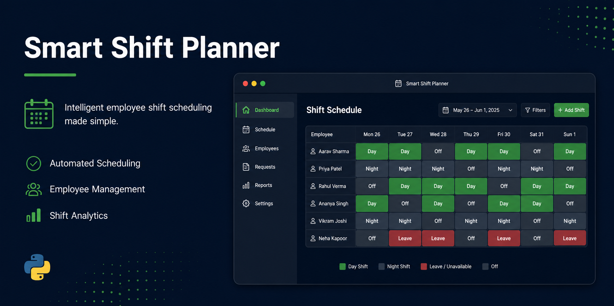

# smart-shift-planner

Python desktop app for employee shift planning. Uses Command, Strategy and State design patterns. Built with openpyxl.
# Smart Shift Planner

Desktop app for employee shift planning built with Python.

## Features
- Load historical data from Excel
- Plan and assign shifts to employees
- Confirm or cancel shifts
- Export schedule to Excel

## Architecture
- **Command** pattern — every action can be undone
- **Strategy** pattern — flexible file loading and export
- **State** pattern — shift states: planned, confirmed, cancelled

## Stack
- Python 3.14
- openpyxl
- tkinter (coming soon)

## Run
```
python main.py
```
